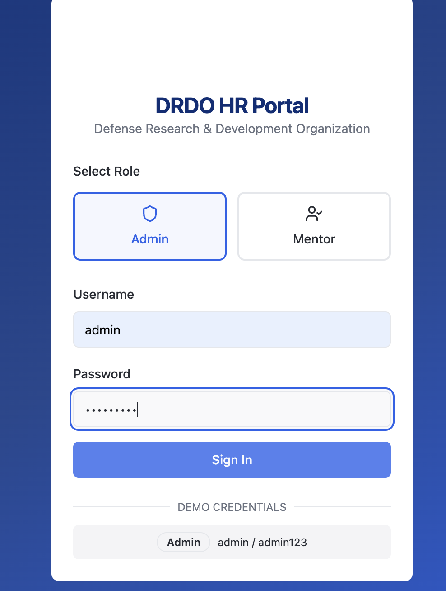
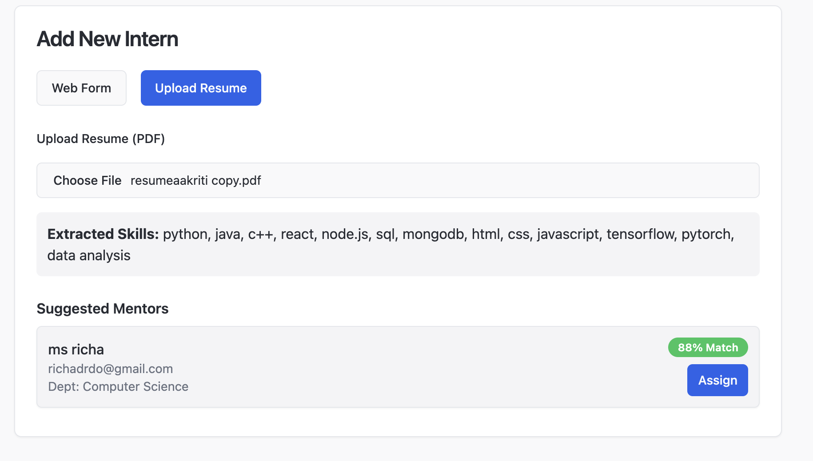
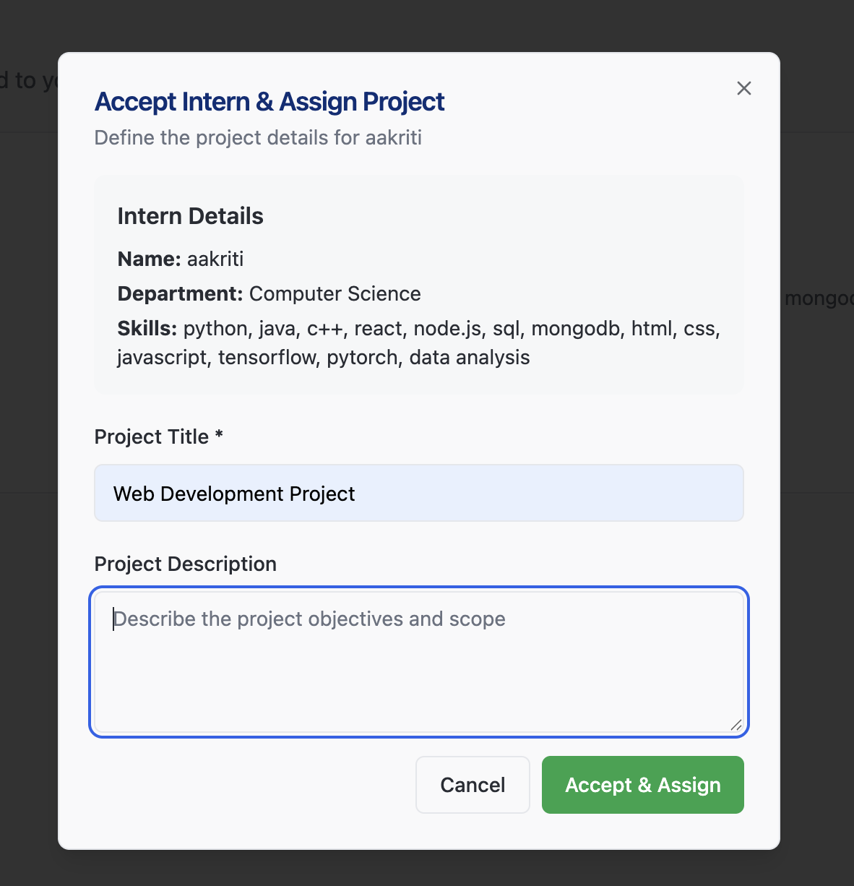
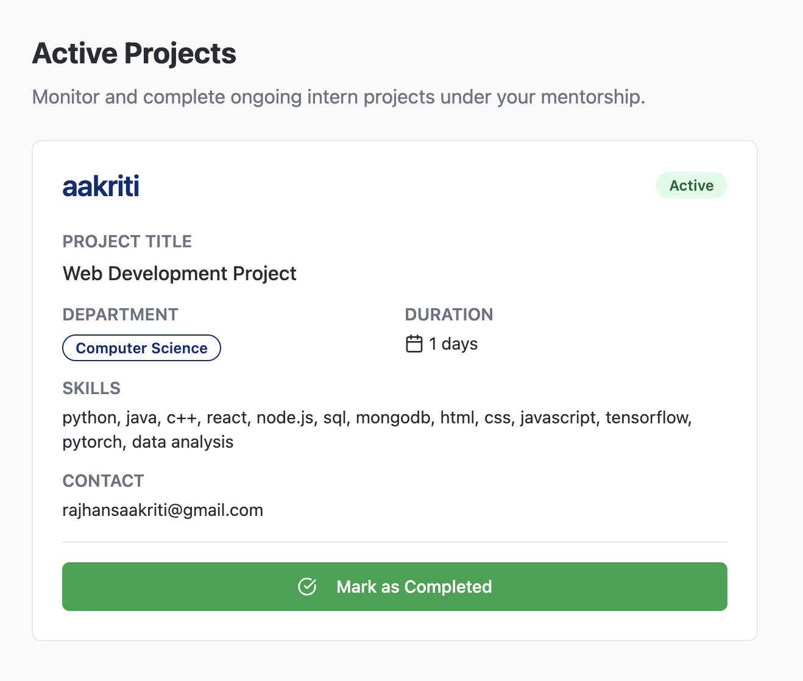
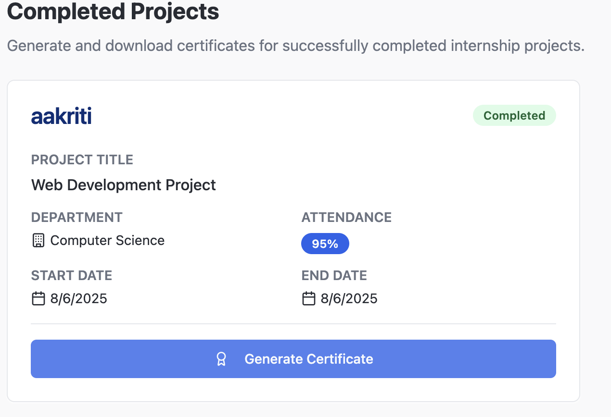

# DRDO Intern Management System

A smart, AI-enhanced internship management platform tailored for research organizations like DRDO.
What once required endless paperwork and manual coordination is now streamlined into a few intelligent clicks.

## Project Description

The DRDO HR Portal is a modern web application that simplifies internship workflows for admins and mentors through two dedicated dashboards:

### Admin Dashboard enables
- Smart Intern Onboarding: Upload resumes, auto-extract skills with NLP, and instantly receive AI-powered mentor match suggestions.
- End-to-End Management: Add mentors, assign interns, track project statuses, and issue verified certificates all in one place.
- Data-Driven Oversight: Access clean, interactive analytics on performance and internship trends.

### Mentor Dashboard enables
- Effortless Assignment Handling: View new intern requests, assign custom projects, or reject with reasoning for smart reassignment.
- Project Monitoring: Track ongoing progress, manage attendance, mark completions, and auto-generate internship certificates.

## ⚙️ Tech Stack

### UI & Frameworks  
Vite, React, TypeScript, Tailwind CSS, shadcn/ui, Radix UI, Recharts, React Router DOM, Axios, PostCSS, ESLint, Zod, LocalStorage

### Client-Side Intelligence  
PDF.js-powered resume parsing  
Custom NLP pipelines in TypeScript for extracting intern skills  
Real-time matching & scoring logic for mentor compatibility

## Setup Guide

### Live Version  
You can explore the deployed portal [here](https://ai-intern-forge-n3l89oijm-aakritiieee7s-projects.vercel.app/)  
Login into the admin dashboard using:  
**Username**: `admin`  
**Password**: `admin123`  

Feel free to add mentors, assign interns, and explore all features.

### Local Installation  
To run the project locally:

1. Download as ZIP or clone the repo:  
   ```bash
   git clone https://github.com/aakritiieee7/hrmanagementsystem.git
   ```

2. Install dependencies:  
   ```bash
   npm install
   ```

3. Start the development server:  
   ```bash
   npm run dev
   ```

## Project Preview

Here are some screenshots showcasing the application's key interfaces:

### Login Page


### Add Intern


### Mentor View - New Requests


### Mentor View - Mark Project as Completed


### Generate Certificate


## Disclaimer

This is a project I built under my internship at DRDO, and copying or plagiarizing is discouraged. It is not affiliated with or officially representing DRDO in any capacity.
